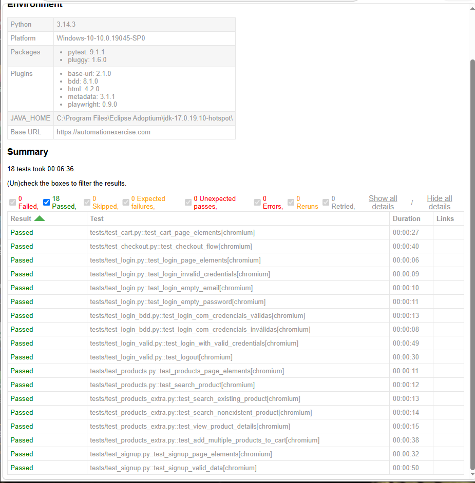

# Testes E2E com Playwright + Python


Projeto de automação de testes end-to-end (E2E) desenvolvido com **Python**, **Playwright** e **Pytest**, seguindo o padrão de projeto **Page Object Model (POM)**. Os testes cobrem os principais fluxos do site [Automation Exercise](https://automationexercise.com), incluindo cadastro, login, navegação de produtos, carrinho de compras e checkout. O fluxo de login também conta com cenários **BDD escritos em Gherkin**, em português.

## 🎬 Demonstração

https://github.com/user-attachments/assets/5d549e11-08ce-4833-bbc4-c3b410f43e72

## 🎯 Objetivo

Este projeto foi desenvolvido como parte do meu portfólio de QA, com o objetivo de demonstrar habilidades práticas em automação de testes web, incluindo:

- Organização de código com Page Object Model
- Cenários BDD em Gherkin com pytest-bdd
- Integração contínua (CI) com GitHub Actions
- Geração de relatórios de execução em HTML e evidências (screenshots, vídeos e traces)
- Investigação e correção de testes instáveis e falhas de pipeline

## 🛠️ Tecnologias utilizadas

- **Python 3.12+** (CI em 3.12, também testado localmente em 3.14)
- **Playwright** — automação de navegador
- **Pytest** — framework de testes
- **pytest-playwright** — integração do Playwright com o Pytest
- **pytest-bdd** — cenários BDD escritos em Gherkin
- **pytest-html** — geração de relatórios em HTML
- **GitHub Actions** — pipeline de integração contínua

## 📁 Estrutura do projeto

```
testes-e2e-playwright-python/
├── .github/workflows/      # Pipeline de CI (GitHub Actions)
├── docs/                   # Imagens usadas na documentação
├── features/               # Cenários BDD escritos em Gherkin
│   └── login.feature
├── pages/                  # Page Objects (elementos e ações de cada página)
│   ├── base_page.py
│   ├── cart_page.py
│   ├── checkout_page.py
│   ├── login_page.py
│   ├── products_page.py
│   └── signup_page.py
├── tests/                  # Casos de teste
│   ├── test_cart.py
│   ├── test_checkout.py
│   ├── test_login.py
│   ├── test_login_bdd.py   # Passos (steps) dos cenários BDD
│   ├── test_login_valid.py
│   ├── test_products.py
│   ├── test_products_extra.py
│   └── test_signup.py
├── conftest.py             # Fixtures compartilhadas do Pytest
├── pytest.ini              # Configurações do Pytest
└── requirements.txt        # Dependências do projeto
```

As pastas `reports/` e `evidencias/` são geradas automaticamente a cada execução e não são versionadas.

## ✅ Cenários testados

- **Cadastro de usuário** — criação de nova conta
- **Login** — cenários de login válido e inválido
- **Produtos** — busca, visualização de detalhes e listagem
- **Carrinho** — adição e verificação de itens
- **Checkout** — finalização do processo de compra

### 🥒 Cenários BDD (Gherkin)

O fluxo de login também foi descrito em linguagem de negócio, em português, para que qualquer pessoa do time (inclusive não técnica) consiga entender o que está sendo testado:

```gherkin
# language: pt

Funcionalidade: Login
  Como um usuário do sistema
  Eu quero fazer login na aplicação
  Para acessar minha conta

  Cenário: Login com credenciais válidas
    Dado que estou na página de login
    Quando informo um email e senha válidos
    E clico no botão de entrar
    Então devo ser redirecionado para a página inicial logada

  Cenário: Login com credenciais inválidas
    Dado que estou na página de login
    Quando informo um email ou senha inválidos
    E clico no botão de entrar
    Então devo ver uma mensagem de erro de login
```

## 🚀 Como rodar o projeto localmente

**Pré-requisitos:** Python 3.12+ instalado

1. Clone o repositório:
```bash
git clone https://github.com/IdnaReis/testes-e2e-playwright-python.git
cd testes-e2e-playwright-python
```

2. Crie e ative um ambiente virtual:
```bash
python -m venv venv
venv\Scripts\activate      # Windows
source venv/bin/activate   # Linux/Mac
```

3. Instale as dependências:
```bash
pip install -r requirements.txt
playwright install --with-deps
```

4. Execute todos os testes:
```bash
pytest -v
```

Para rodar apenas os cenários BDD:
```bash
pytest tests/test_login_bdd.py -v
```

5. O relatório HTML será gerado em `reports/report.html`, e as evidências da execução (screenshots, vídeos e traces) ficam na pasta `evidencias/`.

## 🔄 Integração Contínua (CI)

Este projeto conta com um pipeline configurado no **GitHub Actions** (`.github/workflows/tests.yml`), que executa automaticamente todos os testes a cada push na branch `main`. O pipeline realiza:

1. Checkout do código
2. Configuração do ambiente Python
3. Instalação das dependências
4. Execução dos testes com Pytest

## 🧩 Desafios Técnicos

### 1. Teste de checkout instável no CI

Durante o desenvolvimento, identifiquei uma instabilidade intermitente no teste de checkout: ele passava localmente, mas falhava às vezes no pipeline de CI.

Investigando os logs, percebi que a URL da página no momento da falha continha um parâmetro de anúncio (`google_vignette`) — ou seja, um pop-up publicitário do próprio site estava interceptando o clique no botão de finalizar compra antes da navegação acontecer.

**Solução:** implementei uma lógica de retry no método `go_to_payment()`, que tenta o clique até três vezes, validando a cada tentativa se a navegação para a página de pagamento realmente ocorreu:

```python
def go_to_payment(self):
    for _ in range(3):
        self.place_order_button.click()
        self.page.wait_for_timeout(2000)
        if "payment" in self.page.url:
            return
    raise Exception("Nao foi possivel navegar ate a pagina de pagamento apos varias tentativas")
```

### 2. Pipeline quebrado após adicionar os cenários BDD

Depois de adicionar os cenários BDD, o pipeline de CI passou a falhar, embora os testes funcionassem no ambiente onde foram criados — o clássico "funciona na minha máquina".

Comparando o histórico de commits, percebi que o `requirements.txt` não havia sido alterado junto com o BDD: a biblioteca `pytest-bdd` estava instalada localmente, mas não constava na lista de dependências. Como o pipeline instala apenas o que está no `requirements.txt`, os testes BDD quebravam no CI.

**Solução:** adicionei `pytest-bdd==8.1.0` ao `requirements.txt`, mantendo o padrão de versões fixas do projeto, validei a execução dos cenários localmente antes do push e o pipeline voltou a passar.

**Aprendizado:** toda nova biblioteca usada nos testes precisa entrar no `requirements.txt` no mesmo commit, para que o ambiente do CI seja igual ao ambiente local.

## 📊 Relatórios

Após cada execução, um relatório HTML detalhado é gerado, contendo o status de cada teste. Além disso, o Playwright registra evidências de cada teste (screenshots, vídeos e traces), que ajudam a investigar falhas.



## 👩‍💻 Autora

**Idna Reis**
Profissional de QA | Estudante de Análise e Desenvolvimento de Sistemas

- LinkedIn: [linkedin.com/in/idna-reis](https://linkedin.com/in/idna-reis)
- GitHub: [@IdnaReis](https://github.com/IdnaReis)
